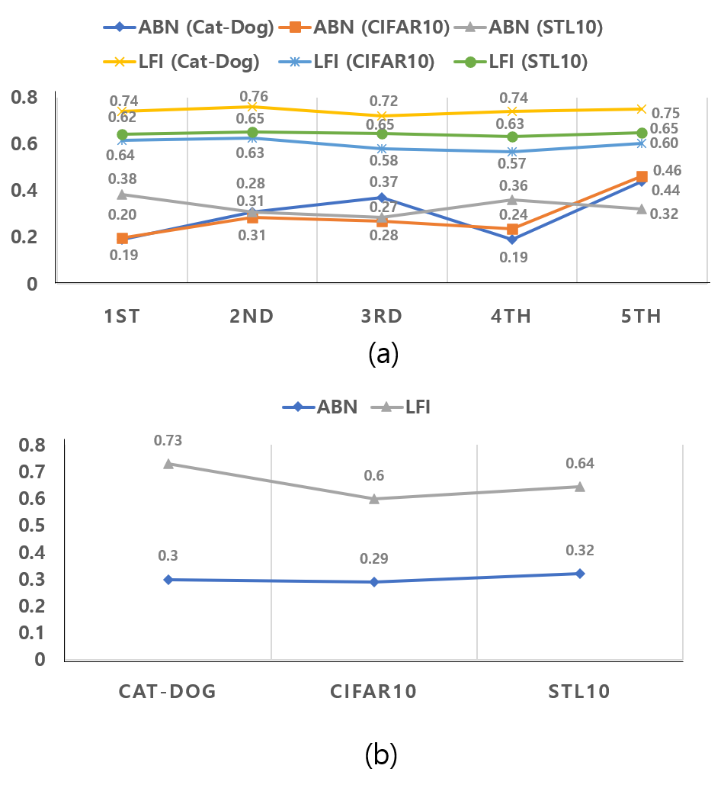

# LFI-CAM

## Abstract

This repository contains source code for the LFI-CAM(Learning of Feature Importance CAM) paper.

[arXiv paper] : https://arxiv.org/pdf/2105.00937.pdf 

Authors: Kwang Hee Lee<sup>1,*,**</sup>, Chaewon Park<sup>1,*</sup>, Junghyun Oh<sup>1,2,*</sup>, and Nojun Kwak<sup>2</sup>

<sup>1</sup>Boeing Korea Engineering and Technology Center(BKETC)
<sup>2</sup>Seoul National University 
* indicates equal contribution
** indicates corresponding author

## Quick Guides
- Using Tensorboard
```
# activate your virtual environment, then..
tensorboard --logdir='board' --port=6006 --host='localhost'

# If you want to change the directory for the tensorboard visualizatoin,
# select where-ever you want(ex: /xxx/yyy/board), and put argument "--board-path /xxx/yyy/board"
```

## Training + Evaluation
### Using Catdog dataset
```
python imagenet.py -a resnet18 --data ./data/catdog --epochs 300 --checkpoint checkpoints/catdog/resnet18
 --gpu-id 0,1,2,3 --lr 0.1 --schedule 150 225 --num_classes 2
```

### Using STL10 dataset
```
python stl.py -a resnet18 --epochs 300 --checkpoint 
checkpoints/stl/resnet18 \
--gpu-id 0,1,2,3 --lr 0.1 --schedule 150 225
```

## Using CIFAR-10 or CIFAR-100 dataset
```
python cifar.py -a resnet --dataset cifar10 --depth 110 --epochs 300 
--schedule 150 225 --gamma 0.1 --wd 1e-4 --checkpoint checkpoints/cifar10/resnet --gpu-id 0,1,2,3
```

### Using ImageNet dataset
```
python imagenet.py -a resnet50 --data ./data/imagenet --epochs 300 
--checkpoint checkpoints/imagenet/resnet50 --gpu-id 0,1,2
```

## Evaluation Only
```
python imagenet.py -a resnet50 --data ./data/imagenet --epochs 1 --checkpoint checkpoints/imagenet/resnet50 
--gpu-id 0,1,2,3 --evaluate --resume checkpoints/neu/res50_mix/best_checkpoint.pth.tar
```


## Environment
```
pip install -r requirements.txt
```

Our source code is based on [https://github.com/bearpaw/pytorch-classification/](https://github.com/bearpaw/pytorch-classification/) and [https://github.com/machine-perception-robotics-group/attention_branch_network/](https://github.com/machine-perception-robotics-group/attention_branch_network) implemented with PyTorch. 
Requirements of PyTorch version are as follows:
- PyTorch : 0.4.0
- PyTorch vision : 0.2.1

## Attention Map Example and Stability Analysis

- (a): ABN result on STL10
- (b): LFI-CAM result on STL10
- (c): ABN result on CatDog
- (d): LFI-CAM result on CatDog




## IoU Calculation
1. Assuming you have trained two models to compare, create attention npy files
```
 python cifar.py -a resnet --depth 110 --dataset cifar100 --epochs 1 --evaluate --resume /base/path/checkpoint.pth.tar --gpu-id 0
```
2. Compare attention values
```
python  utils/metrics.py  --att-base /base/path/att --att-target /target/path/att --threshold 100

```

